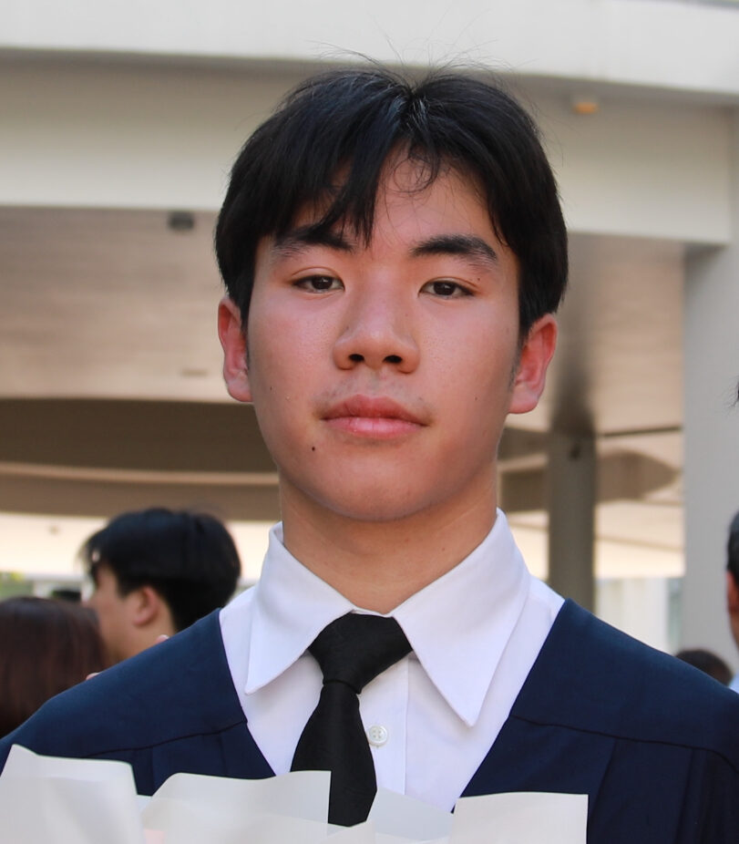

# Boonyapran Adsatit — Portfolio

A cinematic editorial portfolio site for film and television work.

## File structure

```
portfolio/
├── index.html      ← Home (full-screen background video hero + featured films)
├── films.html      ← All projects with trailers and descriptions
├── about.html      ← Bio, education, skills, contact
├── style.css       ← Shared styling for all pages
├── videos/         ← Background video for homepage hero
│   └── background.mp4
├── images/         ← All project stills, portrait, thumbnails
└── README.md       ← This file
```

## Changing the homepage background video

The homepage hero plays `videos/background.mp4` on autoloop, muted. To swap it:

1. Drop a new MP4 into the `videos/` folder (replace `background.mp4`)
2. Also update the poster image at `images/background-poster.jpg` — a still frame that shows while the video loads

**Video specs:**
- MP4 (H.264 codec)
- Under 15MB for fast loading (current file is 3.5MB)
- No audio track (saves space, video is muted anyway)
- 10–20 seconds, designed to loop seamlessly
- 1080p or 720p

To compress a video down, use [Handbrake](https://handbrake.fr) (free):
- Preset: "Web → Gmail Large 3 Minutes 720p30"
- Quality: RF 26-28
- Remove audio track in the Audio tab

## How to deploy to GitHub Pages

### 1. Create a GitHub account

If you don't have one, sign up at https://github.com — use your real name as the username (e.g. `boonyapran`). Your site URL will be `https://boonyapran.github.io`.

### 2. Create the repository

- Click the **+** in the top right of GitHub → **New repository**
- Repository name **must be exactly**: `yourusername.github.io` (replace with your actual GitHub username)
- Set to **Public**
- Tick **Add a README file**
- Click **Create repository**

### 3. Upload the files

**Easy method (no command line):**

1. Download [GitHub Desktop](https://desktop.github.com)
2. Sign in and clone your `yourusername.github.io` repository
3. Open the local folder in your file explorer
4. Copy all the files from this portfolio folder into it (index.html, films.html, about.html, style.css, images/)
5. In GitHub Desktop, write a commit message like "initial site" → click **Commit to main**
6. Click **Push origin**

**Or via the GitHub website:**

1. Open your repo on github.com
2. Click **Add file** → **Upload files**
3. Drag all the files in
4. Click **Commit changes**

### 4. Enable GitHub Pages

1. In your repo, click **Settings** (top right)
2. Click **Pages** in the left sidebar
3. Under **Source**, choose **Deploy from a branch** → **main** → **/(root)** → **Save**
4. Wait 1–2 minutes
5. Visit `https://yourusername.github.io`

That's it — your site is live.

## Adding new projects later (Amy & Losing Round)

Two title-card images have been saved in `images/` for projects not yet on the site:

- `amy-thumb-COMING-SOON.jpg` — *Amy* (your latest project)
- `losing-round-thumb-COMING-SOON.jpg` — *Losing Round*

When ready to add them, send Claude the details (year, roles, genre, description, video link) and they'll be added as full project blocks at the top of the Films page.

## How to add images

The site currently shows placeholder labels where images will go. To add real ones:

1. Drop your images into the `images/` folder
2. Edit the HTML files and uncomment the `` tags (remove `<!--` and `-->`)

Example — in `index.html`, find:
```html
<!--  -->
```
Change to:
```html

```

### Recommended image filenames

```
images/
├── portrait.jpg            (you, for About + Home preview — 3:4 ratio works best)
├── korn-kaew-thumb.jpg     (16:9 landscape thumbnail)
├── korn-kaew-1.jpg         (still 1 for Films page)
├── korn-kaew-2.jpg         (still 2)
├── magnum-opus-thumb.jpg
├── magnum-opus-1.jpg
├── magnum-opus-2.jpg
├── methin-thumb.jpg
├── methin-poster.jpg
├── methin-stage.jpg
├── hero-thumb.jpg
├── hero-1.jpg
├── hero-2.jpg
├── full-moon-thumb.jpg
├── full-moon-1.jpg
├── full-moon-2.jpg
├── chungking-thumb.jpg
├── chungking-1.jpg
└── chungking-2.jpg
```

### Image specs

- **Thumbnails / hero stills**: 1600×900px (16:9), JPG, around 200–400KB each
- **Portrait**: 900×1200px (3:4), JPG
- **Compress before uploading**: use [Squoosh.app](https://squoosh.app) (free) to keep files under 500KB each — this keeps the site fast.

## How to make changes later

Any time you want to update content:

1. Open the HTML file in any text editor (VS Code, Sublime, even Notepad)
2. Edit text directly
3. Save
4. In GitHub Desktop: write a short message → Commit → Push
5. Site updates in ~1 minute

## Want a custom domain later?

When you're ready for `boonyapran.com` or similar:

1. Buy domain at [Cloudflare Registrar](https://www.cloudflare.com/products/registrar/) (~$10/yr, cheapest no-markup option)
2. In your GitHub repo: Settings → Pages → add your custom domain
3. In Cloudflare DNS: add the records GitHub gives you
4. Free HTTPS is automatic

## Design notes

The aesthetic is **editorial cinematic** — designed to evoke Sight & Sound, A24, Criterion Collection.

- **Typography**: Cormorant Garamond (display, italic) + Inter (body) + JetBrains Mono (labels)
- **Colour**: Deep black background, warm amber accent (`#c8a165`), off-white text
- **Texture**: Subtle film grain overlay throughout
- **Layout**: Asymmetric grids, generous negative space, fixed nav with blur

To change the accent colour, edit `style.css` line near the top:
```css
--accent: #c8a165;     /* current: warm amber */
```
Try `#a83232` (deep red) or `#6b8ea3` (cool blue) or `#f5f3ee` (monochrome).

## Browser support

Works on all modern browsers (Chrome, Safari, Firefox, Edge). Fully responsive on phone, tablet, desktop.
